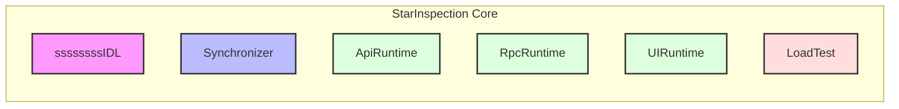

# 🌟 StarInspection Core

<div align="center">

[](https://goreportcard.com/report/github.com/linxs953/SI_Core) [](LICENSE)  [](go.mod)

StarInspection Core 是一个强大的分布式任务调度和执行引擎，为大规模计算任务提供可靠的解决方案。

[English](README_EN.md) | 简体中文

</div>

## 📋 目录

- [项目概述](#-项目概述)
- [系统架构](#-系统架构)
- [快速开始](#-快速开始)
- [部署指南](#-部署指南)
- [配置说明](#-配置说明)
- [开发指南](#-开发指南)
- [许可证](#-许可证)

## 🚀 项目概述

StarInspection Core 是一个基于 Kubernetes 的新一代分布式任务调度和执行系统。它专为大规模分布式计算场景设计，提供了完整的任务生命周期管理解决方案。

### ✨ 核心特性

- 🔄 分布式任务调度与执行
- 📊 实时任务状态同步与监控
- 🔌 灵活的 RPC 和 API 运行时支持
- 📝 强大的任务定义语言(TaskIDL)
- 🎯 智能集群资源管理与优化

## 🏗 系统架构

StarInspection Core 是一个自动化测试执行引擎，由以下核心组件构成：



### 核心组件

- **IDL**: 任务接口定义语言，统一定义各类自动化测试任务的规范和接口
- **Synchronizer**: 文档同步组件，负责：
  - API 文档的同步和管理
  - RPC 服务的 Proto 文件同步
  - UI 组件数据的同步
  - 系统数据迁移
- **ApiRuntime**: API 自动化测试运行时
  - 执行 HTTP/HTTPS API 自动化测试任务
  - 支持 RESTful API 测试场景
  - 提供接口性能和可靠性验证
- **RpcRuntime**: RPC 自动化测试运行时
  - 执行 RPC 服务自动化测试任务
  - 支持 gRPC、Thrift 等协议
  - 提供服务调用链路验证
- **UIRuntime**: UI 自动化测试运行时
  - 执行 Web UI 自动化测试任务
  - 支持跨浏览器测试场景
  - 提供页面交互和视觉测试能力
- **LoadTest**: 压力测试组件
  - 执行系统压力测试任务
  - 提供性能指标采集和分析
  - 支持多场景压测策略

每个组件都是独立的 Kubernetes Operator，通过自定义资源（CRD）进行配置和管理。

### 示例配置

```yaml
# API 自动化测试示例
apiVersion: lct.starinspection.io/v1
kind: ApiRuntime
metadata:
  name: api-test-example
spec:
  endpoint: "https://api.example.com"
  testCases:
    - name: "test-login"
      method: "POST"
      path: "/login"
      assertions:
        - status: 200

# RPC 自动化测试示例
apiVersion: lct.starinspection.io/v1
kind: RpcRuntime
metadata:
  name: rpc-test-example
spec:
  service: "user.UserService"
  method: "GetUserInfo"
  proto: "user.proto"

# UI 自动化测试示例
apiVersion: lct.starinspection.io/v1
kind: UIRuntime
metadata:
  name: ui-test-example
spec:
  url: "https://www.example.com"
  browser: "chrome"
  steps:
    - action: "click"
      selector: "#login-button"

# 压力测试示例
apiVersion: lct.starinspection.io/v1
kind: LoadTest
metadata:
  name: load-test-example
spec:
  target: "https://api.example.com"
  virtualUsers: 100
  duration: "30m"
  rampUp: "5m"
```

## 🚦 快速开始

### 环境要求

| 组件 | 最低版本 |
|------|---------|
| Go | v1.22.0+ |
| Docker | v17.03+ |
| Kubectl | v1.11.3+ |
| Kubernetes | v1.11.3+ |

### 📥 安装步骤

1. **构建并推送镜像**
```bash
make docker-build docker-push IMG=<registry>/starinspection:tag
```

2. **安装 CRD**
```bash
make install
```

3. **部署控制器**
```bash
make deploy IMG=<registry>/starinspection:tag
```

4. **验证安装**
```bash
kubectl get pods -n starinspection-system
```

## 🛠 配置说明

### 示例配置

```yaml
apiVersion: lct.starinspection.io/v1
kind: TaskIDL
metadata:
  name: example-task
spec:
  # 配置详情
```

## 👥 开发指南

### 开发环境设置

1. 克隆仓库
```bash
git clone https://github.com/yourusername/starinspection.git
```

2. 安装依赖
```bash
go mod download
```

### 代码规范

- 遵循标准 Go 编码规范
- 所有新功能必须包含单元测试
- 提交前运行 `make test` 和 `make lint`

### 提交规范

```
feat: 添加新特性
fix: 修复问题
docs: 文档更新
style: 代码格式调整
refactor: 代码重构
test: 测试用例相关
chore: 构建过程或辅助工具的变动
```

## 📄 许可证

Copyright 2024.

Licensed under the Apache License, Version 2.0 (the "License");
you may not use this file except in compliance with the License.
You may obtain a copy of the License at

    http://www.apache.org/licenses/LICENSE-2.0

Unless required by applicable law or agreed to in writing, software
distributed under the License is distributed on an "AS IS" BASIS,
WITHOUT WARRANTIES OR CONDITIONS OF ANY KIND, either express or implied.
See the License for the specific language governing permissions and
limitations under the License.

